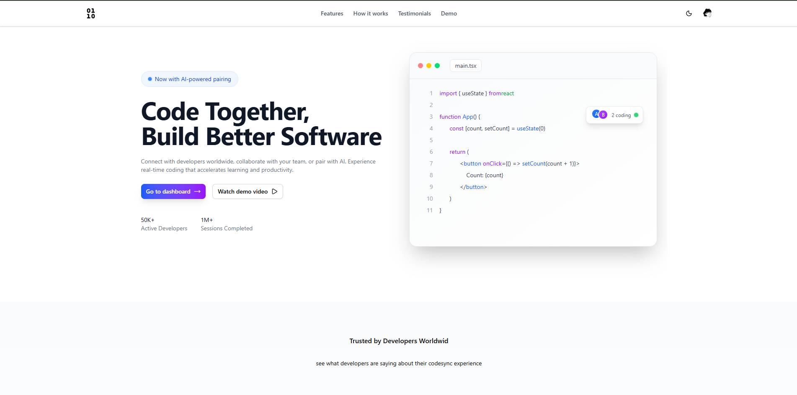
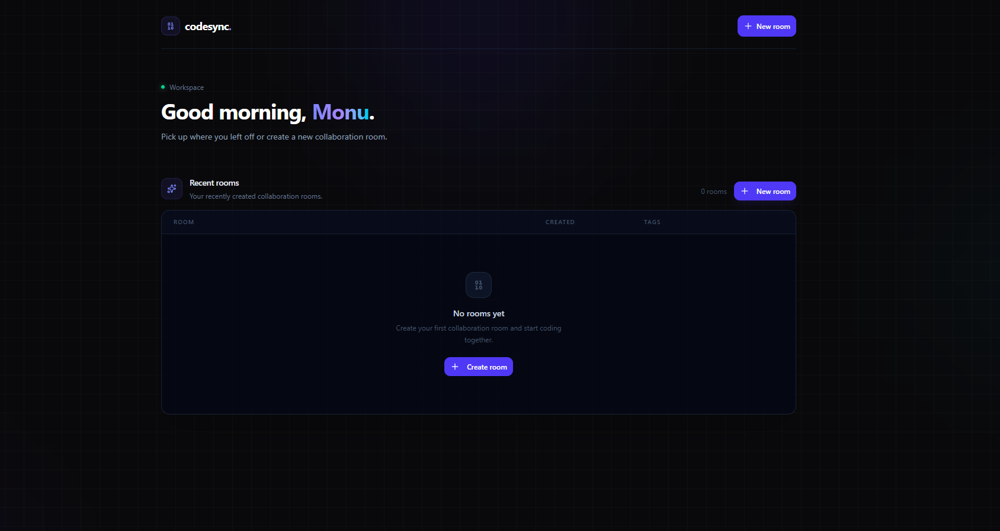
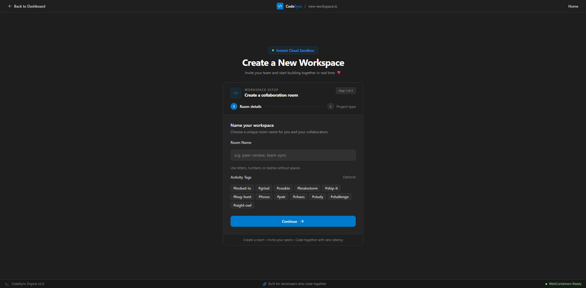
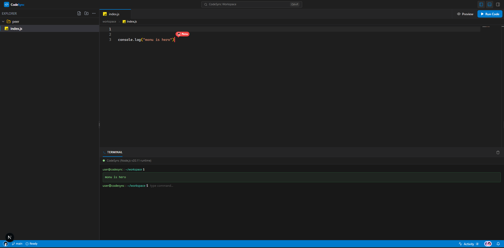
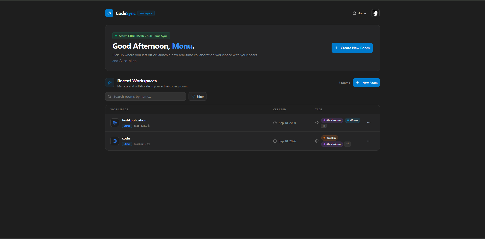
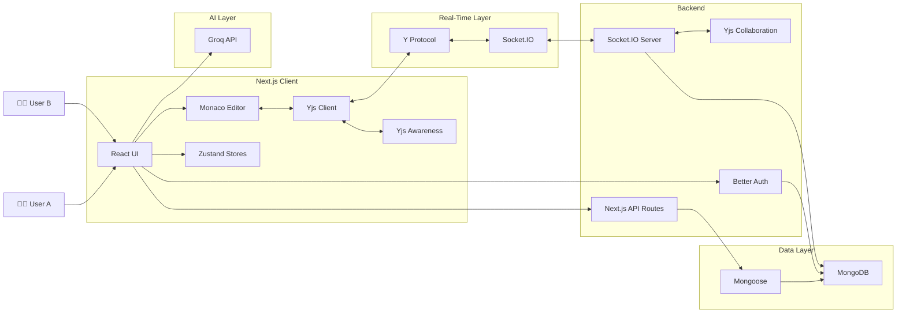

# CodeSync

<div align="center">


# Real-Time Collaborative Workspace

<p>
A modern real-time collaborative coding platform where developers can create rooms,
write code together, manage files, chat in real time, and use an AI coding assistant.
</p>

<p>
  
  
  
  
  
</p>

</div>

---

# Preview

## watch preview

<a href="https://youtu.be/m0cOgL_Tfh8?si=o_WZjIsichypK2nu" >

</a>

## Dashboard

<p align="center">
  
</p>

## Create Workspace

<p align="center">
  
</p>

## Collaborative Workspace

<p align="center">
  
</p>

## Real-Time Collaboration

<p align="center">
  
</p>

---

# Features

| Feature                    | Description                                                |
| -------------------------- | ---------------------------------------------------------- |
| ⚡ Real-Time Collaboration | Multiple users can work on the same workspace in real time |
| 🧠 AI Coding Assistant     | Ask coding-related questions directly inside the workspace |
| 💻 Monaco Editor           | VS Code-like code editing experience                       |
| 📁 File Explorer           | Create and manage nested files and folders                 |
| 🔄 Yjs Synchronization     | CRDT-based collaborative document synchronization          |
| 🔌 Socket.IO               | Real-time communication between clients and server         |
| 💬 Real-Time Chat          | Communicate with other workspace members                   |
| 👥 User Awareness          | Track collaborators and their presence                     |
| 🔐 Authentication          | Secure authentication using Better Auth                    |
| 🔑 Google OAuth            | Sign in using Google                                       |
| ✉️ Email Verification      | Email verification using Resend                            |
| 🗄️ MongoDB                 | Persistent storage for application data                    |
| ⚡ Optimistic UI           | Faster interactions through optimistic updates             |
| 💾 Cached Explorer         | Reduces unnecessary file explorer requests                 |
| ▶️ Code Execution          | Run supported code from the workspace                      |
| 🎨 Responsive UI           | Modern responsive developer-focused interface              |

---

## Built With

<p align="center">
  
  &nbsp;&nbsp;
  
  &nbsp;&nbsp;
  
  &nbsp;&nbsp;
  
  &nbsp;&nbsp;
  
  &nbsp;&nbsp;
  
  &nbsp;&nbsp;
  
  &nbsp;&nbsp;
  
  &nbsp;&nbsp;

</p>

---

## System Architecture



---

# How Collaboration Works

CodeSync uses **Yjs + Socket.IO** to synchronize code changes between users.

```text
                    USER A
                      │
                      ▼
                Monaco Editor
                      │
                      ▼
                    Yjs
                      │
                 Yjs Update
                      │
                      ▼
                 Socket.IO
                      │
                      ▼
              Socket.IO Server
                      │
                Broadcast
                      │
          ┌───────────┴───────────┐
          │                       │
          ▼                       ▼
        USER A                  USER B
          │                       │
          ▼                       ▼
        Yjs Doc                 Yjs Doc
          │                       │
          ▼                       ▼
       Editor                  Editor
```

### Collaboration flow

1. User edits a file.
2. Monaco Editor produces the change.
3. Yjs converts the change into a CRDT update.
4. The update is sent through Socket.IO.
5. The server broadcasts the update.
6. Other connected clients receive the update.
7. Yjs applies the update to their local document.
8. Monaco reflects the synchronized content.

---

# Project Structure

```text
CodeSync/
│
├── app/
│   ├── api/
│   │   ├── auth/
│   │   └── playground/
│   │
│   ├── auth/
│   │   ├── login/
│   │   ├── signup/
│   │   └── verify/
│   │
│   ├── dashboard/
│   │   └── page.tsx
│   │
│   ├── playground/
│   │   ├── page.tsx
│   │   └── [roomId]/
│   │
│   ├── globals.css
│   ├── layout.tsx
│   ├── page.tsx
│   ├── not-found.tsx
│   └── global-error.tsx
│
├── components/
│   ├── constant/
│   ├── dashboard/
│   ├── editor/
│   │   ├── Module/
│   │   ├── Skeleton/
│   │   ├── ui/
│   │   ├── chat.tsx
│   │   ├── CodeWindow.tsx
│   │   ├── FileExplore.tsx
│   │   ├── MonacoEditor.tsx
│   │   ├── Terminal.tsx
│   │   ├── StatusBar.tsx
│   │   └── playHeader.tsx
│   │
│   ├── home/
│   │   ├── ui/
│   │   ├── Demo.tsx
│   │   ├── Footer.tsx
│   │   ├── Header.tsx
│   │   ├── Sidbar.tsx
│   │   ├── features.tsx
│   │   ├── hero.tsx
│   │   ├── howWorks.tsx
│   │   └── testimonial.tsx
│   │
│   ├── ui/
│   ├── login-form.tsx
│   └── signup-form.tsx
│
├── context/
│   ├── layout-context.tsx
│   ├── socketProvider.tsx
│   └── types.ts
│
├── lib/
│   ├── api/
│   ├── hooks/
│   ├── schema/
│   ├── store/
│   │   ├── actions/
│   │   ├── types/
│   │   ├── Codestore.ts
│   │   ├── Explorerstore.ts
│   │   └── Roomstore.ts
│   │
│   ├── awareness.ts
│   ├── auth.ts
│   ├── auth-client.ts
│   ├── db.ts
│   ├── email.ts
│   ├── features.ts
│   ├── getUserId.ts
│   ├── rateLimiter.ts
│   ├── socket.ts
│   ├── utils.ts
│   └── yjs.ts
│
├── model/
│   ├── directory.ts
│   ├── file.ts
│   └── room.ts
│
├── server/
│   ├── src/
│   ├── dist/
│   ├── package.json
│   └── tsconfig.json
│
├── public/
│   ├── architecture.gif
│   ├── logo.svg
│   ├── notFound.gif
│   ├── pixel-heart.gif
│   ├── super-saiyan-goku.gif
│   └── screenshots
│
├── next.config.ts
├── proxy.ts
├── package.json
├── tsconfig.json
└── readme.md
```

---

# Installation

## 1. Clone

```bash
git clone https://github.com/your-username/codesync.git
cd codesync
```

## 2. Install Frontend Dependencies

```bash
npm install
```

## 3. Install Server Dependencies

```bash
cd server
npm install
cd ..
```

## 4. Configure Environment Variables

Create:

```text
.env.local
```

in the project root.

---

# Environment Variables

| Variable                 | Required | Used For                            | Example                 |
| ------------------------ | :------: | ----------------------------------- | ----------------------- |
| `NEXT_PUBLIC_API_URL`    |    ✅    | Frontend API base URL               | `http://localhost:3000` |
| `NEXT_PUBLIC_SOCKET_URL` |    ✅    | Socket.IO server URL                | `http://localhost:4000` |
| `MONGODB_URI`            |    ✅    | MongoDB connection                  | `mongodb+srv://...`     |
| `BETTER_AUTH_SECRET`     |    ✅    | Better Auth session/security secret | `your-secret`           |
| `GOOGLE_CLIENT_ID`       |    ✅    | Google OAuth client ID              | `your-client-id`        |
| `GOOGLE_CLIENT_SECRET`   |    ✅    | Google OAuth client secret          | `your-client-secret`    |
| `RESEND_API_KEY`         |    ✅    | Email verification                  | `re_...`                |

### `.env.local`

```env
NEXT_PUBLIC_API_URL=http://localhost:3000

NEXT_PUBLIC_SOCKET_URL=http://localhost:4000

MONGODB_URI=your_mongodb_connection_string

BETTER_AUTH_SECRET=your_better_auth_secret

GOOGLE_CLIENT_ID=your_google_client_id

GOOGLE_CLIENT_SECRET=your_google_client_secret

RESEND_API_KEY=your_resend_api_key
```

> Never commit `.env.local` to Git. Keep API keys, OAuth secrets, authentication secrets, and database credentials private.

---

# Running Locally

CodeSync has two processes during development:

```text
┌──────────────────────┐
│    Next.js App       │
│    localhost:3000    │
└──────────┬───────────┘
           │
           │ Socket.IO
           ▼
┌──────────────────────┐
│   Socket.IO Server   │
│    localhost:4000    │
└──────────────────────┘
```

### Terminal 1 — Frontend

```bash
npm run dev
```

Open:

```text
http://localhost:3000
```

### Terminal 2 — Backend

```bash
cd server
npm run dev
```

---

# Server

The `server/` directory contains the dedicated real-time backend.

```text
server/
│
├── src/
│
├── dist/
│
├── package.json
│
└── tsconfig.json
```

The server handles real-time communication through Socket.IO and collaboration-related events.

---

# File Explorer

CodeSync supports nested project structures.

```text
giga/
│
├── index.html
├── index.js
│
└── snakeGame/
    └── snakeGame.html
```

Users can:

- Create files
- Create folders
- Create nested folders
- Open files
- Edit files
- Synchronize changes
- Manage project structure

---

# AI Coding Assistant

The workspace includes a coding-focused AI assistant powered by Groq.

Example:

```text
@bot explain this JavaScript function
```

The assistant can help with:

- Code explanations
- Debugging
- Programming concepts
- Code suggestions
- Technical questions

The assistant is intentionally focused on software-development-related requests.

---

# Authentication

CodeSync uses Better Auth for authentication.

Supported features:

- Email/password authentication
- Google OAuth
- Email verification
- Session management
- Protected routes

Resend is used to send verification emails.

---

# Deployment

## Frontend

The Next.js application can be deployed to Vercel.

Configure the production environment variables:

```env
NEXT_PUBLIC_API_URL=https://your-domain.com

NEXT_PUBLIC_SOCKET_URL=https://your-socket-server.com

MONGODB_URI=your_production_mongodb_uri

BETTER_AUTH_SECRET=your_production_secret

GOOGLE_CLIENT_ID=your_production_google_client_id

GOOGLE_CLIENT_SECRET=your_production_google_client_secret

RESEND_API_KEY=your_production_resend_key
```

## Backend

The Socket.IO server should be deployed separately on a platform that supports:

- Persistent Node.js processes
- WebSocket connections
- Long-running server processes

After deployment, update:

```env
NEXT_PUBLIC_SOCKET_URL=https://your-production-socket-server.com
```

---

# Future Improvements

- Drag-and-drop file explorer
- File version history
- Collaborative cursors
- Voice/video communication
- Collaborative whiteboard
- Multiple chat channels
- Improved code execution
- Code autocomplete
- Workspace activity history
- Advanced room permissions

---

<div align="center">

### CodeSync

**Code together. Build together. 🚀**

A real-time collaborative coding workspace built with Next.js, Yjs, Socket.IO, MongoDB, and Groq.

<br />

<a href="https://codesync-lovat.vercel.app/">
  
</a>

<br />
<br />

⭐ If you find CodeSync useful, consider giving the repository a star!

</div>

---

<p align="center">
  Made with ❤️ for developers
</p>
