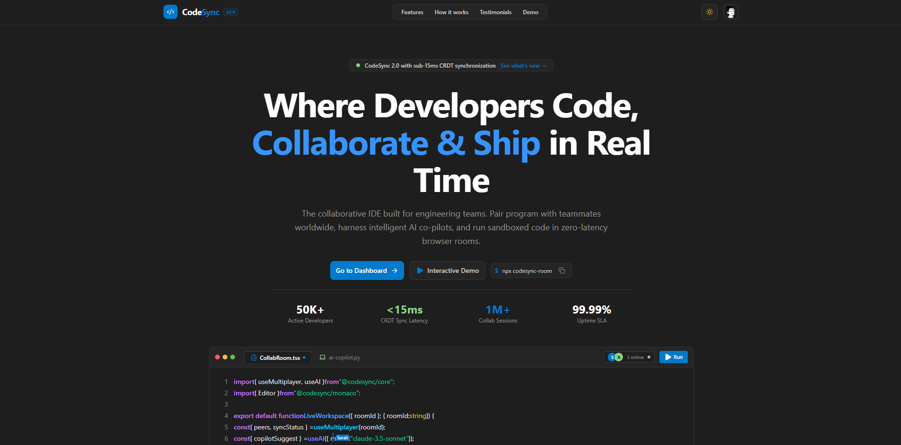
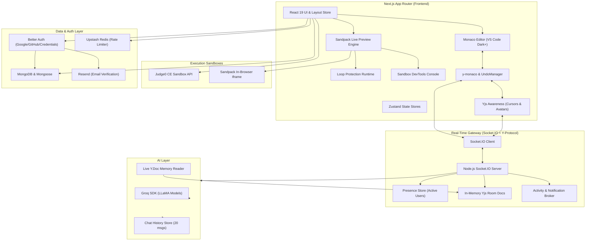

# CodeSync

<div align="center">


# Real-Time Collaborative Cloud Workspace

<p align="center">
  <b>A modern, high-performance collaborative coding platform and browser IDE.</b><br />
  Create workspaces, write code together in real time, manage nested project trees, preview apps with live hot-reloading, run code in sandboxed containers, and pair-program with an in-editor AI Copilot.
</p>

<p align="center">
  <a href="https://codesync-lovat.vercel.app/">
    
  </a>
  &nbsp;
  <a href="https://youtu.be/m0cOgL_Tfh8?si=o_WZjIsichypK2nu">
    
  </a>
</p>

<p align="center">
  
  
  
  
  
  
  
  
  
  
  
</p>

</div>

---

## 📺 Video Demo & Preview

Watch CodeSync in action on YouTube:  
👉 **[Watch CodeSync Demo](https://youtu.be/m0cOgL_Tfh8?si=o_WZjIsichypK2nu)**

---

## 📸 Screenshots

### Landing Page
<p align="center">
  
</p>


### Collaborative Workspace & Monaco Editor
<p align="center">
  
</p>

### Dashboard & Project Management
<p align="center">
  
</p>

---

## 🚀 Key Features

| Feature | Description |
| :--- | :--- |
| ⚡ **CRDT Real-Time Collaboration** | Conflict-free document editing powered by **Yjs** and **Socket.IO** with sub-millisecond sync |
| 👥 **Collaborative Cursors & Presence** | Real-time remote cursor badges with collaborator avatars, names, custom colors, and idle fading |
| 🤖 **Context-Aware AI Copilot** | Pair programmer powered by **Groq** with live Yjs document inspection and quick slash commands |
| 🌐 **In-Browser Live Preview (Sandpack)** | Live interactive browser preview for HTML/CSS/JS, React, Vue, and Svelte with instant hot reload |
| 🛡️ **Infinite Loop Protection Runtime** | AST/regex non-blocking loop guard that halts runaway `while`/`for` loops to prevent browser tab freezing |
| 🔍 **In-Preview DevTools Console** | Built-in developer console capturing and streaming `log`, `warn`, `info`, and `error` from sandbox iframes |
| 💻 **Integrated Terminal & Code Runner** | Multi-language remote code execution for JS, TS, Python, C++, Java, Go, and Rust via **Judge0 CE** |
| 📁 **VS Code-Style File Explorer** | Nested folders and files, context menus for rename/delete, optimistic caching, and file icons |
| 🎨 **Authentic VS Code Ergonomics** | Dark+ theme, minimap, bracket pair colorization, breadcrumbs, and collapsible/resizable split panels |
| 🔔 **Notification Center & Live Feed** | VS Code notification flyout drawer, toast alerts, and a status bar ticker tracking member actions in real time |
| 🏷️ **Multi-Project Workspaces** | Tagging, search filtering, room renaming, and support for static web and modern framework project types |
| 🔐 **Comprehensive Authentication** | Secure authentication via **Better Auth** supporting Google OAuth, GitHub OAuth, and email/password |
| ⚡ **Rate Limiting & Caching** | Token-bucket API protection, Upstash Redis caching, and optimized client state with **Zustand** |

---

## 🛠️ Built With

<p align="center">
  <a href="https://nextjs.org/"></a>
  &nbsp;&nbsp;&nbsp;
  <a href="https://react.dev/"></a>
  &nbsp;&nbsp;&nbsp;
  <a href="https://www.typescriptlang.org/"></a>
  &nbsp;&nbsp;&nbsp;
  <a href="https://tailwindcss.com/"></a>
  &nbsp;&nbsp;&nbsp;
  <a href="https://microsoft.github.io/monaco-editor/"></a>
  &nbsp;&nbsp;&nbsp;
  <a href="https://socket.io/"></a>
  &nbsp;&nbsp;&nbsp;
  <a href="https://nodejs.org/"></a>
  &nbsp;&nbsp;&nbsp;
  <a href="https://www.mongodb.com/"></a>
  &nbsp;&nbsp;&nbsp;
  <a href="https://groq.com/"></a>
  &nbsp;&nbsp;&nbsp;
  <a href="https://sandpack.codesandbox.io/"></a>
  &nbsp;&nbsp;&nbsp;
  <a href="https://vercel.com/"></a>
</p>

---

## 🏛️ System Architecture



---

## 🔄 How Collaboration & Syncing Works

CodeSync ensures zero merge conflicts using **Yjs CRDTs (Conflict-free Replicated Data Types)** over bidirectional **Socket.IO** connections.

```text
    USER A (Editor)                                        USER B (Editor)
         │                                                      │
    1. Keypress                                            7. Remote cursor/text updates
         ▼                                                      ▲
   [Monaco Editor]                                        [Monaco Editor]
         │                                                      │
    2. Local Model Change                                  6. Apply CRDT Transaction
         ▼                                                      ▲
  [y-monaco Binding]                                     [y-monaco Binding]
         │                                                      │
    3. Yjs CRDT Vector Update                              5. Receive Yjs Update
         ▼                                                      ▲
   [Socket.IO Client] ─────────▶ [Socket.IO Server] ───────────▶ [Socket.IO Client]
                                (Memory Y.Doc & Broadcast)
                                        │
                                        ▼
                                [Presence & Cursors]
                                (Awareness Protocol)
```

### Collaborative Workflow
1. **User Edit**: A developer types or deletes code in Monaco Editor.
2. **CRDT Encoding**: `y-monaco` captures the diff and converts it into a binary CRDT update vector.
3. **Optimistic & Local**: The editor renders immediately with zero perceived latency.
4. **WebSocket Broadcast**: The update is sent to the Node.js Socket.IO server and merged into the active in-memory room `Y.Doc`.
5. **Peer Replication**: The server broadcasts the delta to all other room participants.
6. **Convergence**: Connected peers apply the transaction into their local Yjs document, updating their Monaco Editor buffer seamlessly.
7. **Awareness & Cursors**: User selection ranges, cursor coordinates, names, and avatars are tracked via Yjs Awareness and rendered as floating cursor badges with idle fading.

---

## 🌟 Feature Deep Dive

### 1. 🌐 Live In-Browser Preview & Multi-Framework Sandboxes
- **Instant Preview**: Run web code instantly inside the workspace without running external build steps.
- **Auto Framework Detection**: Automatically analyzes files and dependencies in `package.json` to detect:
  - Static HTML/CSS/JavaScript
  - React (TypeScript & JSX)
  - Vue 3
  - Svelte
  - Vanilla TypeScript & JavaScript
- **Multi-Page Route Navigation**: Embedded browser navigation bar with Back, Forward, Reload, URL route selector (e.g. `preview/about.html`), and external new-tab launch.
- **Fullscreen Mode**: Expand the preview into a distraction-free full-screen display.

### 2. 🛡️ Infinite Loop Protection Runtime
Accidentally typing an infinite loop like `while(true)` in vanilla browser sandboxes will freeze the developer's entire browser tab.  
CodeSync solves this with an **intelligent AST/regex loop instrumenter**:
- Injects non-blocking runtime checks (`window.__protectLoop`) into `for`, `while`, and `do-while` loops.
- Terminates execution safely if a loop runs longer than 1500ms without yielding.
- Dispatches a clear error diagnostic to the integrated preview console instead of locking up the user's browser.

### 3. 🤖 Context-Aware AI Copilot (Powered by Groq)
- **Live Memory Inspection**: CodeSync Copilot doesn't just read static files—it reads the exact, live in-memory Yjs CRDT document from the active room.
- **Active File Context**: Automatically detects the file open in the developer's tab and injects relevant code context into the prompt.
- **Slash Commands**:
  - `/explain` — Breaks down complex logic and algorithms step by step.
  - `/fix` — Inspects code for edge cases, null pointer risks, and logical bugs.
  - `/tests` — Automatically writes comprehensive unit test suites.
  - `/refactor` — Cleans up code, improves readability, and optimizes performance.
- **Rich Markdown Formatting**: Code output with syntax highlighting, custom copy buttons, and expandable code previews.

### 4. 💻 Multi-Language Code Execution (Terminal)
- Interactive terminal built directly into the bottom drawer.
- Powered by **Judge0 CE API** to compile and run code in isolated Linux containers.
- Supports **JavaScript, TypeScript, Python, C, C++, Java, Rust, Go, PHP, Ruby, and more**.
- Formatted stdout, stderr, compile errors, and execution status indicators.

### 5. 👥 Collaborative Cursors & Presence Tracking
- Real-time cursor coordinates broadcasted via Yjs Awareness.
- Distinct vibrant colors assigned to each collaborator.
- Floating badges with collaborator avatars and display names.
- Smooth caret movement interpolation and non-interfering pointer events.
- **Smart Idle Fading**: Collaborators inactive for more than 4 seconds automatically fade out so active cursors stay visible.

### 6. 🔔 Real-Time Notification Center & Activity Feed
- **Live Activity Ticker**: Animated ticker in the VS Code status bar showing room actions as they occur.
- **Activity Feed Drawer**: Detailed log of user entries, leaves, file creations, and edits.
- **Notification Bell**: VS Code-style notification icon with unread badges, error counters, and toast popups.

### 7. ⌨️ Authentic VS Code Ergonomics
- Custom **VS Code Dark+** theme tuned for readability and contrast.
- Signature **VS Code Command Center** with `Ctrl+P` quick search.
- Collaborative `Ctrl+Z` (Undo) and `Ctrl+Shift+Z` / `Ctrl+Y` (Redo) via `Y.UndoManager`.
- Toggle word wrap with `Alt+Z`.
- Quick save with `Ctrl+S`.
- Resizable, collapsible split-panel layout (File Explorer, Code Window, Bottom Terminal, and Copilot/Preview Sidebar).

---

## ⌨️ Keyboard Shortcuts

| Shortcut | Action | Scope |
| :--- | :--- | :--- |
| <kbd>Ctrl</kbd> + <kbd>S</kbd> / <kbd>Cmd</kbd> + <kbd>S</kbd> | Save active file to database | Editor |
| <kbd>Ctrl</kbd> + <kbd>Z</kbd> / <kbd>Cmd</kbd> + <kbd>Z</kbd> | Collaborative Undo | Editor |
| <kbd>Ctrl</kbd> + <kbd>Shift</kbd> + <kbd>Z</kbd> / <kbd>Ctrl</kbd> + <kbd>Y</kbd> | Collaborative Redo | Editor |
| <kbd>Alt</kbd> + <kbd>Z</kbd> | Toggle Word Wrap | Editor |
| <kbd>Esc</kbd> | Exit Fullscreen Preview | Live Preview |
| <kbd>Enter</kbd> (in Chat) | Send message to AI Copilot | Chat Input |
| <kbd>Shift</kbd> + <kbd>Enter</kbd> | Insert newline in chat | Chat Input |

---

## 📂 Project Structure

```text
codesync/
├── app/
│   ├── api/
│   │   ├── auth/                  # Better Auth API endpoints
│   │   └── playground/            # Workspace & file CRUD routes
│   ├── auth/
│   │   ├── login/                 # Login page
│   │   ├── signup/                # Signup page
│   │   └── verify/                # Email verification page
│   ├── dashboard/                 # Workspaces dashboard & recents
│   ├── playground/
│   │   ├── page.tsx               # Workspace creation wizard
│   │   └── [roomId]/page.tsx      # Collaborative IDE workspace
│   ├── layout.tsx
│   └── page.tsx                   # High-converting landing page
│
├── components/
│   ├── auth/                      # Auth headers & OAuth buttons
│   ├── dashboard/                 # Workspace creation form, row items, filtering
│   ├── editor/
│   │   ├── Module/                # Code expander, file save modals
│   │   ├── preview/               # Sandpack preview, DevTools console, drawer
│   │   ├── Skeleton/              # VS Code-style loading skeletons
│   │   ├── ui/                    # TabBar, Cursors, Bubble, ChatInput, ActivityFeed
│   │   ├── CodeWindow.tsx         # Resizable editor + terminal pane
│   │   ├── FileExplore.tsx        # Recursive file tree with context menus
│   │   ├── MonacoEditor.tsx       # Monaco + Yjs binding + collaborative cursors
│   │   ├── StatusBar.tsx          # Status bar with activity ticker & presence popover
│   │   ├── Terminal.tsx           # Multi-language terminal & Judge0 runner
│   │   ├── chat.tsx               # CodeSync Copilot secondary sidebar
│   │   ├── playHeader.tsx         # VS Code titlebar & panel toggles
│   │   └── sidebar.tsx            # Collapsible right panel (Chat / Preview)
│   ├── home/                      # Landing page sections (Hero, Features, Testimonials)
│   └── ui/                        # Radix UI primitives & custom components
│
├── context/
│   ├── socketProvider.tsx         # Socket.IO React context provider
│   └── types.ts                   # Socket event and message types
│
├── lib/
│   ├── api/                       # Axios client, room API, file API, code execution
│   ├── hooks/                     # useYjs, useScroll hooks
│   ├── store/                     # Zustand stores (Code, Explorer, Layout, Notification, Room)
│   ├── auth.ts                    # Better Auth server configuration
│   ├── auth-client.ts             # Better Auth client hooks
│   ├── db.ts                      # MongoDB connection helper
│   ├── features.ts                # File icons, language mapping, Sandpack VFS generator
│   └── rateLimiter.ts             # Token-bucket rate limiting
│
├── model/                         # Mongoose schemas (Room, Directory, File)
│
├── server/                        # Dedicated Real-Time Socket.IO Server
│   ├── src/
│   │   ├── services/
│   │   │   ├── handlers/          # yjs.ts, room.ts, aiChat.ts, activity.ts
│   │   │   ├── store/             # yjStore.ts, presence.ts, chatstore.ts
│   │   │   ├── socket.ts          # Socket lifecycle & Groq initialization
│   │   │   └── types.ts
│   │   └── index.ts               # HTTP & WebSocket bootstrap
│   ├── package.json
│   └── tsconfig.json
│
├── public/                        # Branding, gifs, and landing assets
├── next.config.ts
└── package.json
```

---

## ⚡ Getting Started

### Prerequisites

Make sure you have installed:
- **Node.js** (v18.x or v20.x+)
- **npm** or **pnpm**
- **MongoDB** instance (Local or MongoDB Atlas)
- **Groq API Key** (from [console.groq.com](https://console.groq.com/))

---

### 1. Clone the Repository

```bash
git clone https://github.com/monushah108/codesync.git
cd codesync
```

---

### 2. Install Dependencies

#### Frontend
```bash
npm install
```

#### Real-Time Backend
```bash
cd server
npm install
cd ..
```

---

### 3. Configure Environment Variables

#### Frontend Environment (`.env.local`)
Create `.env.local` in the root directory:

```env
# App Configuration
NEXT_PUBLIC_API_URL=http://localhost:3000
NEXT_PUBLIC_SOCKET_URL=http://localhost:8000

# Database
MONGODB_URI=mongodb+srv://<username>:<password>@cluster.mongodb.net/codesync?retryWrites=true&w=majority

# Better Auth
BETTER_AUTH_URL=http://localhost:3000
BETTER_AUTH_SECRET=your_super_secret_auth_key_min_32_characters

# Social OAuth (Optional for local dev)
GOOGLE_CLIENT_ID=your_google_client_id
GOOGLE_CLIENT_SECRET=your_google_client_secret
GITHUB_CLIENT_ID=your_github_client_id
GITHUB_CLIENT_SECRET=your_github_client_secret

# Email Service (Optional for local dev)
RESEND_API_KEY=re_your_resend_api_key

# Upstash Redis (Optional for rate limiting)
UPSTASH_REDIS_REST_URL=https://your-redis-instance.upstash.io
UPSTASH_REDIS_REST_TOKEN=your_upstash_redis_token
```

#### Server Environment (`server/.env`)
Create `.env` inside the `server/` directory:

```env
PORT=8000
CLIENT_URL=http://localhost:3000
AI_API_KEY=gsk_your_groq_api_key
AI_MODEL=llama-3.3-70b-versatile
```

---

### 4. Run Locally

You can run both processes concurrently in two terminal tabs:

#### Terminal 1 — Frontend (Next.js)
```bash
npm run dev
```
Open **[http://localhost:3000](http://localhost:3000)** in your browser.

#### Terminal 2 — Real-Time Collaboration Server (Socket.IO + Groq)
```bash
cd server
npm run dev
```
The server will start listening on port `8000`.

---

## 🌐 Deployment

### Frontend (Vercel)
1. Push your repository to GitHub.
2. Import the repository into **Vercel**.
3. Set the Environment Variables under **Project Settings → Environment Variables**:
   - `NEXT_PUBLIC_API_URL` → Your Vercel production domain (e.g., `https://codesync.vercel.app`)
   - `NEXT_PUBLIC_SOCKET_URL` → Your deployed socket server URL
   - `MONGODB_URI`
   - `BETTER_AUTH_SECRET`
   - `BETTER_AUTH_URL`
   - `GOOGLE_CLIENT_ID`, `GOOGLE_CLIENT_SECRET`
   - `RESEND_API_KEY`
4. Click **Deploy**.

### Backend (Render / Railway / DigitalOcean / VPS)
Because WebSocket servers require persistent long-lived TCP connections, deploy `server/` to a service that supports persistent Node.js processes (e.g., Railway, Render Web Service, or a VPS):
1. Set Root Directory to `server`.
2. Build Command: `npm run build`
3. Start Command: `npm start`
4. Add environment variables:
   - `PORT` (or use provider's default port)
   - `CLIENT_URL` → Your frontend production domain (e.g., `https://codesync.vercel.app`)
   - `AI_API_KEY` → Groq API key
   - `AI_MODEL` → `llama-3.3-70b-versatile`
5. Once deployed, update `NEXT_PUBLIC_SOCKET_URL` in your frontend Vercel deployment.

---

## 🔮 Roadmap

- [ ] WebRTC voice and video huddles inside the workspace
- [ ] Collaborative interactive whiteboard / canvas
- [ ] Drag-and-drop file tree reordering
- [ ] Git commit & push integration directly from the IDE
- [ ] Multi-tab split view (side-by-side file comparison)
- [ ] AI code inline completion (Ghost text while typing)
- [ ] Role-based room access control (Viewer vs. Editor permissions)

---

## 🤝 Contributing

Contributions, issues, and feature requests are welcome!  
Feel free to check out the [issues page](https://github.com/monushah108/codesync/issues).

1. Fork the project
2. Create your feature branch (`git checkout -b feat/AmazingFeature`)
3. Commit your changes (`git commit -m 'Add some AmazingFeature'`)
4. Push to the branch (`git push origin feat/AmazingFeature`)
5. Open a Pull Request

---

<div align="center">

### CodeSync

**Code together. Build together. Ship together. 🚀**

<br />

<a href="https://codesync-lovat.vercel.app/">
  
</a>

<br /><br />

⭐ If you found CodeSync inspiring or useful, please consider giving this repository a star!

<br />

Made with ❤️ for developers worldwide

</div>
